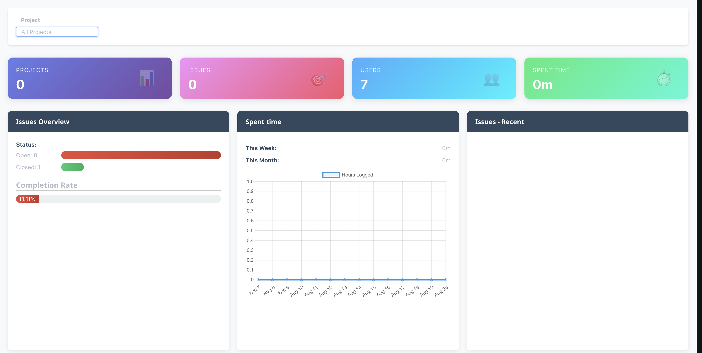
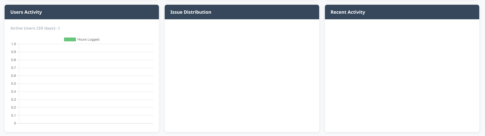

### Redmine Dashboard Pro

🚀 Redmine Dashboard Pro is a modern and feature-rich dashboard plugin for Redmine.
It provides project-level and global-level dashboards with charts, graphs, and metrics to give teams a clear overview of their work progress, issues, and project health.

## ✨ Features

- 📊 Overall Dashboard
  - Displays a summary across all projects
  - Global statistics, charts, and metrics
  - Quick insights into issue distribution, priorities, and statuses
- 📁 Project Dashboard
  - Dedicated dashboard inside each project
  - Visual representation of project-specific data
  - Charts for open/closed issues, assignee workloads, and timelines
- 🔄 Project Switcher
  - Easily switch between projects from the dashboard
  - Smooth navigation for multi-project environments
- 📈 Rich Visuals
  - Interactive charts & graphs
  - Supports issue statistics, difficulty breakdown, priorities, and sprint details
- 🎨 Modern UI
  - Clean, responsive design
  - Sidebar toggle support
  - Works seamlessly in both light & dark themes

## 📦 Installation

1. Clone or download this plugin into your Redmine plugins directory:

```bash
cd redmine/plugins
git clone https://github.com/your-org/redmine_dashboard_pro.git
```

2. Restart your Redmine server:

```bash
rails s
# or
touch tmp/restart.txt
```

## ⚙️ Usage
- Navigate to "Dashboard" from the Redmine top menu.
- Use the project switcher to switch between dashboards.
- Access overall dashboard from the main menu, and project dashboards from within a project.

## 📷 Screenshots
Overall Dashboard

(Aggregated data across projects)




## 🔧 Compatibility

- Redmine 4.x – 5.x
- Ruby 2.6+ / Rails 6.0+

## 🤝 Contributing

Contributions, issues, and feature requests are welcome!
Feel free to submit a pull request or open an issue in the repository.

## 📜 License

This project is licensed under the MIT License.
See the LICENSE file for details.

## 🙌 Credits
Built with ❤️ by sivamanikandan.

👉 With this README, your plugin will look professional and developer-friendly.